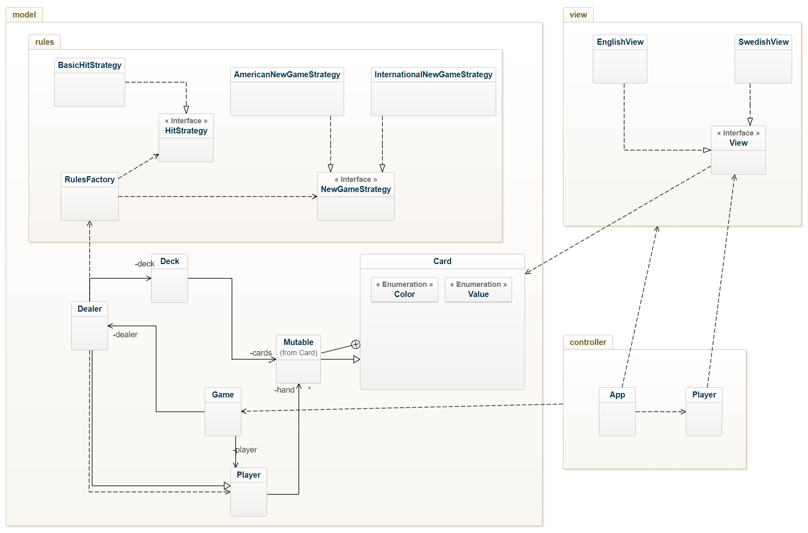

# BlackJack OO-Design
This document describes the current design. Note that some dependencies have been left out for readability reasons. For example there are a lot of dependencies to the Card class.

## Class Diagram
The application uses the model-view-controller (MVC) architectural pattern. The view is passive and gets called from the controller. 

## Stand - Sequence Diagram
This is the detailed sequence diagram for the `Game.stand` method. This is what should be implemented.

Right now the process of the getting the card and dealing it has responsibility scattered around the classes  Deck, Card and Dealer.  
Asking the question, "Who should be responsible for dealing the cards when playing?" hints that the Dealer should be responsible since the Dealer is the one in charge.   
The deck *holds* the cards which in turn is managed by the Dealer. The sole purpose of the Deck is to be a container for cards which flags the Deck class as an information expert.  
It is not necessary for the player to have the method "dealCard(Card c)" since the player is *dealt* the card.   

## What difference does it make in terms of cohesion and coupling?
### 1. Dealer being responsible for the Deck and dealing cards

### 2. Splitting the responsbility across the classes
   

---
## Observer implementation
Events shall be sent to the UI whenever a card is drawn. The UI *observes* the game and gets notified whenever a card is drawn.  
The NewGame rules also deals, the initial ones.   
The classes that involve dealing cards are:
- Dealer.java
- Game.java
  
Game.java has **hit()** that uses *Dealer.dealCard(Card c)* which could be used to pause and refresh the UI.  
Whenever a new game is started, the *hit()* method is not used to deal the initial cards. This is done by the **Dealer** class with its *dealCard(Card c)* method.  
The most appropriate approach would be to have Dealer notify its subscribers that a card has been dealt, since the dealer is actually the one dealing the cards.  

