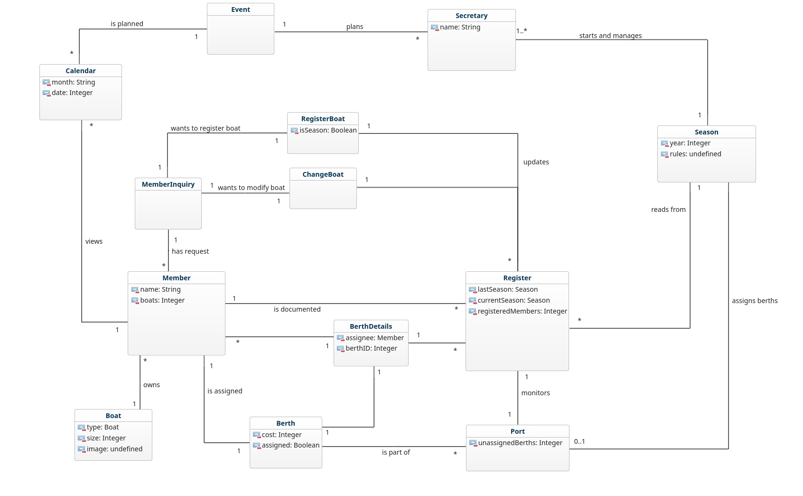

Author: *Lukas Gunnarsson, Datateknik*  
Tools used: Vim, GenMyModel

---

## Initial thoughts
The structure of the yacht club is in chaos as a whole.
There is issues regarding:
- Communication
- Bookings
- Payments

Members have a hard time keeping track of all information that is said within the club.
There is no simple approach to get "your" spot if you have several boats, thus endorcing members to trade spots which is against the rules.

---

## Requirements
As of now, economics is out of the picture which render the current requirements to be
- Register boat
- Remove Boat
- Change Boat
- Assign Berths
- Manage Calendar Event
- List Calendar Events
- Show Calendar Event

Boats and berths do complement each other whilst the calendar is more on its own.
The requirements can be summarized:

- Members should be able to modify their boat (register, remove, change) and its placement
- Members should be able to view all current events in the calendar. Particular events should also be viewable with the event details and information being presented.
- The club calendar is managed by the secretary and has features for adding/removing events

---
## Classes
- Secretary
- Member
- MemberInquiry
- Calendar
- Boat
- Berth
- BerthDetails
- Register
- Dock
- Port
- Event
- Season
- RegisterBoat
- ChangeBoat
---
ChangeBoat is also used for removing boats.

---
## Structure
Members are registered within Register with BerthDetails provided IF they have a boat assigned to a berth.  
Otherwise the Member is only documented within Register to keep track of all members within the club.  
Whenever a member wants to either modify current boat (change data or simply remove it) or register a new one, this task is done by class MemberInquiry.  
It shall be seen as an association class which in turn can determine how or if the asked inquiry can be execeuted.  
Whenever something is done successfully that was requested by a member, the register is updated.  
Secretary is in charge of the start of the season. Whenever there is a new season, data gets fetched from Register which provides necessary information regarding last season and the berth layout within the club port.  
The Secretary is in charge of Season which provides Secretary with a recommended layout according to the season last year and the current registered members this year. Tweaks can be made if needed.  
When the season is started, Secretary assigns the berths via Season and the current layout is registered to Register.  

