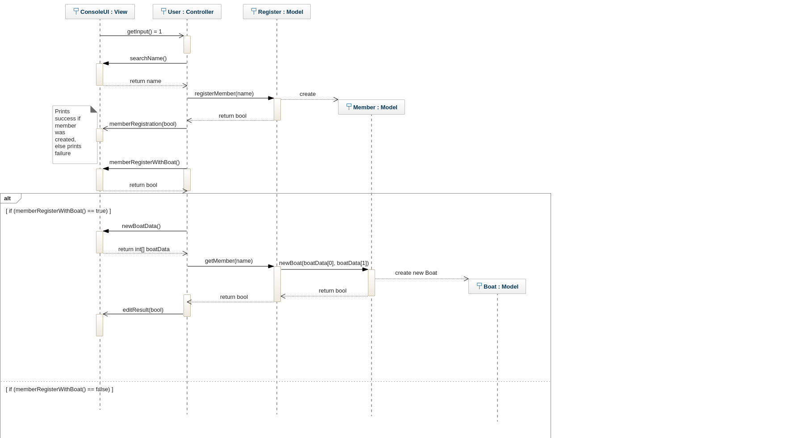

### !! Outdated, new notes in design.md !!

# Assignment 2, CRUD system
#### Group: Lukas Gunnarsson, Datateknik
#### Tools: Vim, GenMyModel, Lucidchart, Visual Studio Code
---
## The app
The application is using a kind of a GUI in the konsole to provide a simple interface.
The requirements stated:
- [x] Register a member
- [x] Delete a member
- [x] Change a members information (this includes boats and details concerning that)
- [x] Look at a specific members information
- [x] Register a new boat for a member
- [x] Delete a boat
- [x] Change a boats information
- [x] Implement a persistance interface
- [x] Add hard-coded data
- [x] Strict Model-View-Controller architecture
- [x] Good quality of code
- [x] Object oriented design and implementation
- [x] Simple error handling
- [x] Proper use of versioning
- [x] Build pipeline using gradle
- [x] Class diagram that shows the final application
- [x] Sequence diagram that corresponds to a scenario where a new member registration takes place
---
## Issues

### Register class
The register class began to get a little big during development and I'm not too happy about that.  
Taking into account the concepts of GRASP, the register *should* be the **creator** of new members since it *holds/records* them. It is the **expert**.  
Still I feel like the class is cluttered with many methods just bloating the whole structure.  
Since the member has an identification badge, new ID's will have to be created as well and this is done by sending a message from User -> Register -> Member -> Identificaton which in turn does what it is told.  
If there were to be another class that was in charge of member inquiries the process would follow this pattern, User -> MemberInquiryClass -> Identification (this is **NOT** taking into consideration that the member has to be fetched as well).
A newly generated ID would be generated and the class this is bound to would already be tied to a member, and the update process would be done.  
What way provides a result that has low coupling and high cohesion?

#### View package
  
I thought it was to be a good idea with some extra classes to decrease the amounts of code within some classes but it wasn't executed very well.  
BoatMenu and MemberMenu would be better of with an abstract class to implement of some sort, but still, inheriting necessary input methods is needed.  
The ErrorHandler class is dead weight really. If I had more time I'd fix some of that stuff.  
The GraphicalUserInterface was also seen as something of a decrease in code/maintainability but that is something that im also is not too proud over.  
The coupling is quite strong, but I can design the console menu freely within the GUI class without destroying the rest which was my goal there.  

---
### Controller package
A secretary class would be of good use but I was too late to implement it and just went with this instead.

---

The app should work fine in console.
---

---

