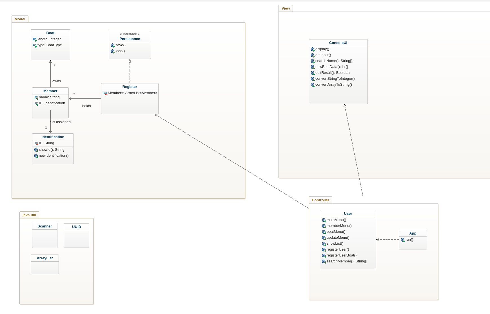
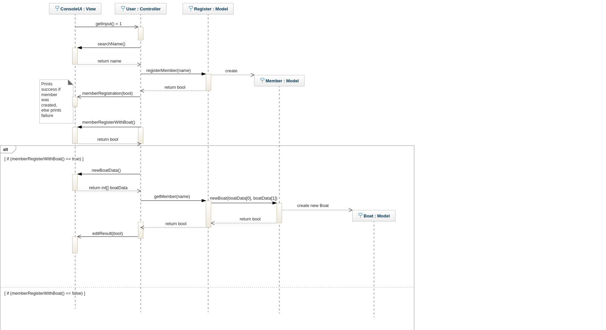

## Boatclub OO-design
### Updated version, try 1

## Console 
(1) equals **YES**  
(2) equals **NO**  
It can be hard sometimes to understand where the program is at, but the quit prompt uses the **Continue?** message and input is marked by **INPUT:**.  

### View
My initial design was very incoherent and all over the place. One major issue I recognized quite fast was the use of the *view*.  
I had methods just printing different statements regarding the state of the program, whereas most of the methods actually were void.  
This made everything look messy and it was also contributing code being very coupled, since the code couldn't decide on its own what to print. 
The **GUI** class had to be called for every single print statement (I had good intentions at the start...) but this just grew in to a mess.  
A better approach would be to make use of boolean values that themselves are returned from operations inside the model.  
These represent the state of the program in its core (given that the returned values from the model are written correctly).  
By doing this the methods has higher probability of reuse since the **Register** delegate the work to be done to Member and Boat etc. and then report back to the controller.  
The returned boolean values indicate a state of A or B. This is very useful for the *view*.  
I removed lots of the *successful/failed* report messages since they were simply just print statements.  
Instead I introduced a bit more of boolean methods which read the returned value of an operation within the model and then decided what to print.  
Therefore the classes such as *GraphicalUserInterface*, *BoatMenu*, *MemberMenu* and *UserInterface* could be merged in to a new class *ConsoleUI*.  
  
There is no need for anything else in view with this simple implementation.  
Having ConsoleUI be the single class responsible for I/O operations seems appropriate.  

---

### Controller

I must note that if I were to redo it all from scratch, I'd be more strict with the use of a facade controller.  
During the later stages of implementation it became clear to me that the controller should be expanded and the model as well.  
The economy was not implemented in this version. Still the code has to be able to change and not break.  
An admin role seems highly appropriate for a system such as this and I didn't add it in this version.  
Even without specifically an admin class, the need would still be there for something to tidy up the controller.   
I'd like to get it more straight forward, clearer.  
Have it delegate tasks and not necessarily perform them itself, which is a problem that I have, kind of.  
Even if the controller do delegate the tasks, it does not do it in a way that is comprehensable enough.  
Single line statements should point the direction of the program and the rest shall be done by the model/view (depending on the task of course).   
The menues for boat and member (especially boat) are cryptic and hard to follow.  
It is easy to couple the classes unnecessarily if the code is hard to read.  
   

---

### Model

The model should've been expanded instead of totally packed with methods and functionality to make sure everything *"works"*  in the end.  
The Register holds information concerning members, their boats, events, etc. and it could be argued that the economy could be held in Register as well.  
But should it? By the looks of just having the members and their boats, the register is having enough on it's plate as it already is.  
Just because it can *hold* information does not make it certain for it to actually do that task.  
If it only acts as a container then the functionality of it manipulating members and memberinfo will introduce lots of ground to cover, making it incohesive.  
A sort of logger could be of use to document transactions, member registrations etc, but the members themselves being registered within Register.  
The controller accesses the Register , which acts as a facade to the data within the system, and does what it needs to do.  
I got a little frustrated when the Register started losing its *"grip"*. I really started to appreciate the benefits of planning and managing your code here.  
The regular user vs the admin shall have different privilegies when using the software, which could introduce something such as an enquiry system for members.  
Something that acts as a facade to the model with restrained access to such as admin permissions (delete members, view transactions).  
The admin could use the whole system and the regular user would use a version where it was stripped of power.  
A member/client system could reduce the load and responsibilities placed on current classes within model.  
Since things are meant to be implemented later, it's useless to rewrite all the code once new things are appearing (which I knew to be implemented sooner or later).  
Which makes it quite stupid to continue to throw too much responsibility on classes that shouldn't carry that load as well.  

The way of returning information from model and sending it to view is something that I would've done better.  
I'm not really a big fan of using the string buffer in Member and Register.  
The data could be sent back in an array or whatever instead of using the string buffer.  
There are lots of things to reconsider, and so little time! 

---

### Class Diagram

### Sequence Diagram
  
If user wishes to register **without** boat, the process will not start hence why the alt version of where *bool==false* is empty.  
