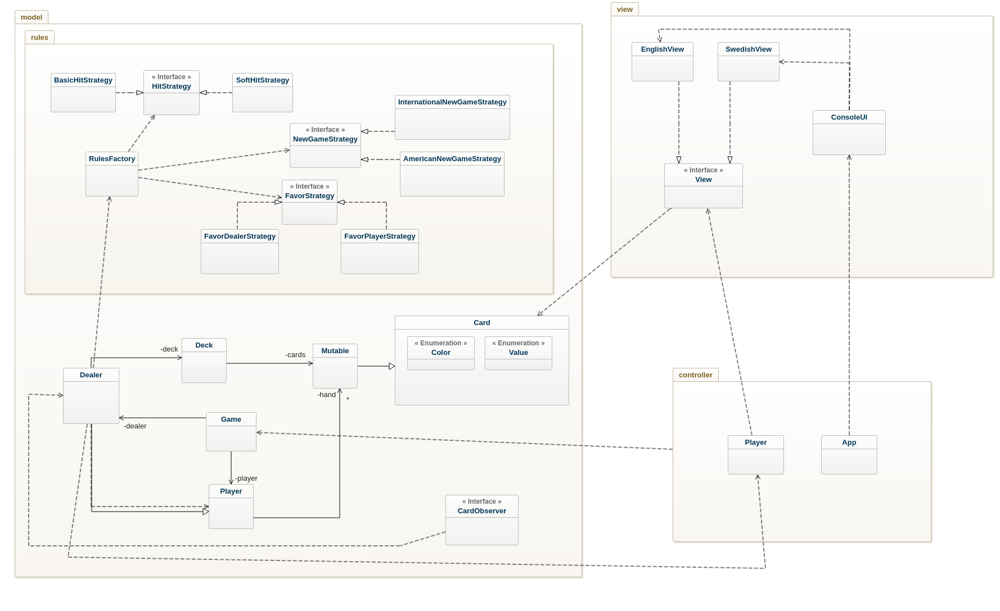

# BlackJack Dice Game
Author: Lukas Gunnarsson, datateknik


### Updated Class Diagram




### Stand Sequence diagram showcasing Game calling stand() method


---
## Requirement 4, remove the bad hidden dependency.

I changed the App and Player classes a bit, removing the extra View dependency from App by creating a ConsoleUI class that behaves as an factory for UI instances.  
The requirement stated *"play, hit, stand, quit"* which involved the UI getting input and returning it to the controller was the thing to focus on.   
I'm still not entirely sure what the correct solution is. The game methods (newGame, hit, stand) gets called if user input matches either character (p, h, s, q).  
One of the changes I did was to try to separate the menu from itself. There is no need to hit or stand if a game isn't played.  
Either a new game is started and later won/lost/exited.  Thus starting a new game should be prompted after one is played or quitted.  
I tried to code this approach and I recognized I stumbled around a lot while doing it, especially in the end.  
To keep a game playing (keep it looping) a while loop is placed within App. I'd rather have a simple call be made from App to Player.  
Something like this:
```     
    Game g = new Game();
    ConsoleUI ui = new ConsoleUI() ;
    Player player = new Player(g, ui.getEnglishUI());
    player.playGame();
  
```
Instead of this:
```
    Game g = new Game();
    ConsoleUI ui = new ConsoleUI() ;
    Player player = new Player(g, ui.getEnglishUI());
    while (player.playGame());
```

---

## Assigning card responsibility

Initially the process of the getting the card and dealing it had responsibility scattered around the classes Deck, Card and Dealer.  
Asking the question, "who should be responsible for dealing the cards when playing?" hints that the Dealer should be responsible since the Dealer is the one in charge of the cards.    
The deck *holds* the cards which in turn is managed by the Dealer. The sole purpose of the Deck is to be a container for cards which flags the Deck class as an information expert.  
It is not necessary for the player to have the method "dealCard(Card c)" since the player is *dealt* the card.   
Having the Dealer be responsible for the cards and where they go aligns very well with the real world, hence keeping the representational gap low.  
The dealer **is** a Player, but all players are **not** Dealers. Players do not deal cards within the game, so it is not their responsibility to do that.

---
## Observer implementation
Events shall be sent to the UI whenever a card is drawn. The UI *observes* the game and gets notified whenever a card is drawn.  
The NewGame rules also deals cards, the initial ones.
The classes that involve dealing cards are:
- Dealer.java
- Game.java
  
Game has the method **hit()** that uses *Dealer.dealCard(Card c)* which could be used to pause and refresh the UI.  
Whenever a new game is started, the *hit()* method is not used to deal the initial cards. This is done by the **Dealer** class with its *dealCard(Card c)* method.  
The most appropriate approach would be to have Dealer notify its subscribers that a card has been dealt, since the dealer is actually the one dealing the cards as stated earlier.  
If *Game.* was to be used, lots of more code would have to be modified to include the initial card dealings.  
Since the initial dealings is a part of the beginning of a game, they are not essentially *hits*.  
Whenever a card is dealt, *Dealer* notifies its observers/subscribers which in this occasion is controller.Player.  
Player being notified, sends a message to the UI with the provided card from the notification message and the player type that drew the card.  
In turn the UI updates the console and pauses the game to simulate a card being drawn.  

---
## Soft rule 17 implementation with test cases

### NOTE! 


The build will build unsuccessfully if BasicHitRule was to be used instead since I didn't modify RulesFactory to set different strategies at runtime.  
If the Soft17 tests are ignored then every rule can be tested without problems.

---
The soft 17 rule is implemented with test cases.  
The test cases test the Dealer.stand() method with the doHit() method from the rules.  
Different hands are valued at values that are either the same or under/over the value 17.  
Since the dealer is supposed to hit at values of 17 if there is an Ace, the amount of cards is predictable and can be measured to see if the rule is working or not.  
The same goes for all the test cases in one way or another.  
- If the hand is valued over 17, the amount of cards shall be unchanged.
- If the hand is valued under 17, the amount of cards shall be increased
- If the hand is valued at 17 with an Ace, hit. 
- If the hand is valued at 17 without an Ace, stand.  
---

## FavorStrategy 
FavorDealerStrategy and FavorPlayerStrategy takes scenarios such as equal scores or if both players go bust and computes the score in favor one or the other.  


## NewGameStrategy
The dealing of the cards (as stated earlier) was assigned to the Dealer.  
Instead of writing each card to be dealt, the Dealer deals cards within a loop taking in to account how many cards being dealt and if it's hidden or not.  
The Deck dependency was also removed by doing this, initially the Deck was being sent as a parameter but since the Dealer was dealing the cards the Deck is not necessary to be sent.  
When a Dealer object is created, a Deck is also created which makes it possible to remove the Deck parameter to the NewGameRule.  